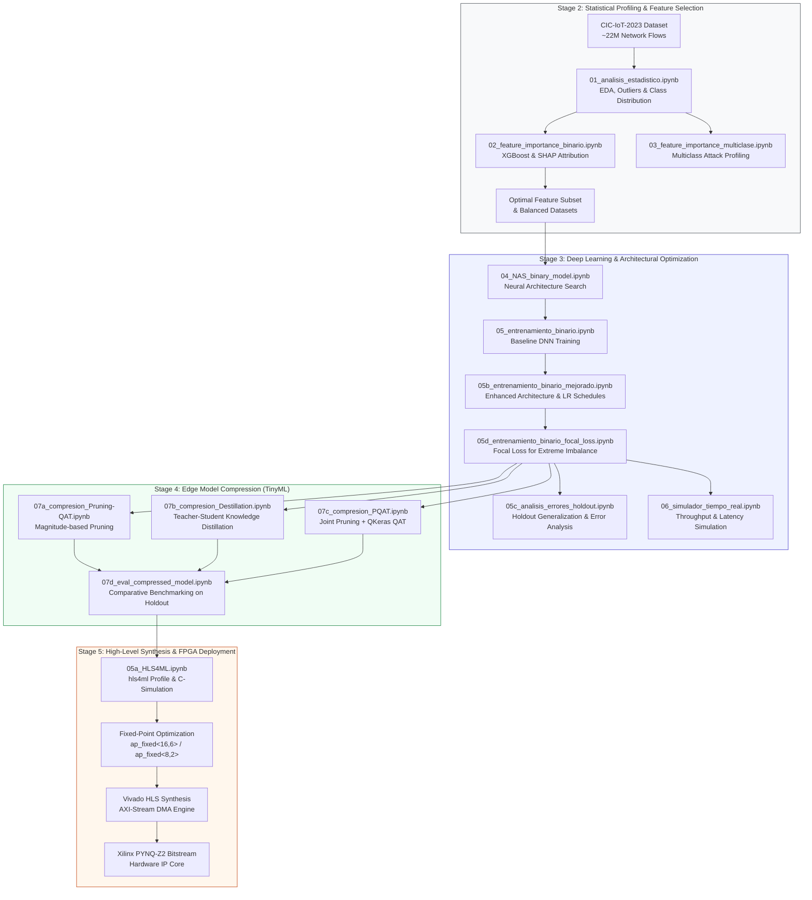

# Hardware-Accelerated Passive Intrusion Detection System for IoT (IDS-IoT)

[](https://www.python.org/)
[](https://www.tensorflow.org/)
[](https://github.com/google/qkeras)
[](https://fastmachinelearning.org/hls4ml/)
[](http://www.pynq.io/)
[](https://www.unb.ca/cic/datasets/iot-dataset-2023.html)
[](#)

---

## 📌 Abstract & Overview

The proliferation of Internet of Things (IoT) edge devices introduces critical cybersecurity vulnerabilities due to strict constraints on computational power, memory bandwidth, and real-time processing latency. Traditional signature-based or compute-heavy Deep Learning Intrusion Detection Systems (IDS) are ill-suited for on-device deployment in high-throughput IoT networks.

This repository presents an **end-to-end, hardware-accelerated, passive Intrusion Detection System (IDS)** specifically designed for resource-constrained edge architectures. Operating over the comprehensive **CIC-IoT-2023** benchmark dataset (~22 million network flows), the system implements a complete research and engineering pipeline:

1. **Statistical Characterization & Explainable AI (XAI)**: High-dimensional flow profiling and SHAP/XGBoost feature attribution for optimal feature reduction.
2. **Constrained Neural Architecture Search (NAS)**: Deep Neural Network (DNN/MLP) design optimized under strict parameter budgets and trained using **Binary Focal Loss** to counter extreme class imbalances.
3. **Advanced Model Compression**: Systematic evaluation of Weight Pruning ($\sim 60\%$ target sparsity), Quantization-Aware Training (QAT with QKeras), Knowledge Distillation (KD), and combined Pruned Quantization-Aware Training (PQAT).
4. **FPGA High-Level Synthesis (HLS)**: Hardware translation via `hls4ml`, performing fixed-point precision profiling (`ap_fixed<W,I>`), C-simulation, RTL synthesis (VHDL/Verilog), and AXI-DMA IP Core generation for the **Xilinx PYNQ-Z2 (Zynq-7000 SoC)** board.

---

## 🔄 End-to-End Pipeline Architecture



---

## 📂 Repository Structure & File Catalog

```
IDS-IOT/
├── notebooks/
│   ├── Etapa_2/               # Exploratory Data Analysis & Feature Selection
│   │   ├── 01_analisis_estadistico.ipynb
│   │   ├── 02_feature_importance_binario.ipynb
│   │   ├── 03_feature_importance_multiclase.ipynb
│   │   ├── Analisis de valores de features.png
│   │   ├── Distribucion de clases CIC-IOT2023.png
│   │   ├── SHAP_BarPlot_Binary.png
│   │   ├── SHAP_Beeswarm_binary.png
│   │   ├── estructura_arbol_0.png
│   │   ├── xgb_modelo_binario.json
│   │   └── Percentiles/
│   ├── Etapa_3/               # Model Exploration, Training & Evaluation
│   │   ├── 04_NAS_binary_model.ipynb
│   │   ├── 05_entrenamiento_binario.ipynb
│   │   ├── 05b_entrenamiento_binario_mejorado.ipynb
│   │   ├── 05c_analisis_errores_holdout.ipynb
│   │   ├── 05d_entrenamiento_binario_focal_loss.ipynb
│   │   └── 06_simulador_tiempo_real.ipynb
│   ├── Etapa_4/               # Model Compression (Pruning, QAT, Distillation, PQAT)
│   │   ├── 07a_compresion_Pruning-QAT.ipynb
│   │   ├── 07a_compresion_Pruning-QAT_corregido.ipynb
│   │   ├── 07b_compresion_Destillation.ipynb
│   │   ├── 07c_compresion_PQAT.ipynb
│   │   └── 07d_eval_compressed_model.ipynb
│   └── Etapa_5/               # Hardware High-Level Synthesis (HLS)
│       ├── 05a_HLS4ML.ipynb
│       ├── plotting.py
│       └── hls_Prj/
├── enviroments/               # Cross-Platform Conda Environments
│   ├── environment.yml
│   ├── environment_hpc.yml
│   ├── environment_linux.yml
│   ├── verificar_entorno.py
│   └── README.md
├── models/                    # Exported Weights, Checkpoints & Visual Topology
│   ├── 51epochs_128batch/
│   ├── 71epochs_64batch/
│   ├── 92epochs_32batch/
│   ├── Destillation_15epochs_128batch/
│   ├── PQAT_15epochs_128batch/
│   ├── QAT_15epochs_128batch/
│   ├── mlp_v2/
│   └── arquitectura_ganadora_binario.png
├── data/                      # Dataset Storage (Feather Serialized Formats)
│   ├── dataset_eda_temp.feather
│   ├── df_binary_balanced.feather
│   └── test_real_traffic.feather
├── artifacts/                 # Serialized Artifacts & Encoders
└── README.md                  # Project Master Documentation
```

---

## 🔬 Granular File & Notebook Catalog

### 1. `notebooks/Etapa_2/` — Statistical Characterization & Feature Selection
| File | Scientific Objective & Methodology | Primary Outputs / Artifacts |
|---|---|---|
| [`01_analisis_estadistico.ipynb`](file:///c:/Users/julia/OneDrive/Desktop/IDS-IOT/notebooks/Etapa_2/01_analisis_estadistico.ipynb) | Exploratory Data Analysis (EDA) of the raw CIC-IoT-2023 dataset. Evaluates 47+ features across ~22M flows, detecting nulls, infinite values, skewed distributions, and inter-feature Pearson correlations. | Distribution plots, percentile distributions, data sanitization specs. |
| [`02_feature_importance_binario.ipynb`](file:///c:/Users/julia/OneDrive/Desktop/IDS-IOT/notebooks/Etapa_2/02_feature_importance_binario.ipynb) | Tree-based feature importance ranking for binary classification (Benign vs. Attack). Trains an optimized XGBoost model and applies **SHAP (SHapley Additive exPlanations)** to isolate key hardware-friendly features. | `xgb_modelo_binario.json`, `SHAP_BarPlot_Binary.png`, `SHAP_Beeswarm_binary.png`. |
| [`03_feature_importance_multiclase.ipynb`](file:///c:/Users/julia/OneDrive/Desktop/IDS-IOT/notebooks/Etapa_2/03_feature_importance_multiclase.ipynb) | Multiclass feature ranking identifying discriminative features capable of differentiating specific attack taxonomies (DDoS, DoS, Recon, Web, BruteForce, Spoofing, Mirai). | Multiclass importance matrices and attack-specific feature signatures. |

### 2. `notebooks/Etapa_3/` — Deep Learning Modeling & Architectural Optimization
| File | Scientific Objective & Methodology | Primary Outputs / Artifacts |
|---|---|---|
| [`04_NAS_binary_model.ipynb`](file:///c:/Users/julia/OneDrive/Desktop/IDS-IOT/notebooks/Etapa_3/04_NAS_binary_model.ipynb) | Constrained Neural Architecture Search (NAS) evaluating layer depths, neuron widths, activation functions, and parameter count trade-offs suitable for FPGA BRAM/DSP limits. | `arquitectura_ganadora_binario.png`, optimal DNN baseline topology. |
| [`05_entrenamiento_binario.ipynb`](file:///c:/Users/julia/OneDrive/Desktop/IDS-IOT/notebooks/Etapa_3/05_entrenamiento_binario.ipynb) | Baseline training of the selected DNN model on balanced network traffic partitions (`df_binary_balanced.feather`). | Initial model checkpoints (`51epochs_128batch`, `71epochs_64batch`, etc.). |
| [`05b_entrenamiento_binario_mejorado.ipynb`](file:///c:/Users/julia/OneDrive/Desktop/IDS-IOT/notebooks/Etapa_3/05b_entrenamiento_binario_mejorado.ipynb) | Hyperparameter tuning and architecture refinement utilizing batch normalization, dropout, Cosine Annealing/ReduceLROnPlateau learning schedules. | Improved baseline model (`mlp_v2`). |
| [`05c_analisis_errores_holdout.ipynb`](file:///c:/Users/julia/OneDrive/Desktop/IDS-IOT/notebooks/Etapa_3/05c_analisis_errores_holdout.ipynb) | Holdout validation on unseen, natural (unbalanced) traffic (`test_real_traffic.feather`). Evaluates ROC-AUC, PR-AUC, False Positive Rate (FPR), and decision threshold sensitivity. | Confusion matrices, threshold calibration curves, per-class error reports. |
| [`05d_entrenamiento_binario_focal_loss.ipynb`](file:///c:/Users/julia/OneDrive/Desktop/IDS-IOT/notebooks/Etapa_3/05d_entrenamiento_binario_focal_loss.ipynb) | Training with **Binary Focal Loss** ($\alpha=0.25, \gamma=2.0$) to mitigate class imbalance and focus gradients on hard-to-classify edge samples. | Robust teacher model with suppressed false alarms. |
| [`06_simulador_tiempo_real.ipynb`](file:///c:/Users/julia/OneDrive/Desktop/IDS-IOT/notebooks/Etapa_3/06_simulador_tiempo_real.ipynb) | Real-time traffic stream simulation testing batch inference throughput, per-packet classification latency, and memory consumption. | Latency vs. batch size benchmarks in software execution. |

### 3. `notebooks/Etapa_4/` — Edge Compression (TinyML)
| File | Scientific Objective & Methodology | Primary Outputs / Artifacts |
|---|---|---|
| [`07a_compresion_Pruning-QAT.ipynb`](file:///c:/Users/julia/OneDrive/Desktop/IDS-IOT/notebooks/Etapa_4/07a_compresion_Pruning-QAT.ipynb) / `_corregido` | Magnitude-based weight pruning enforcing 50%–70% sparsity combined with Quantization-Aware Training using TensorFlow Model Optimization (TF-MOT). | `QAT_15epochs_128batch/` compressed weights. |
| [`07b_compresion_Destillation.ipynb`](file:///c:/Users/julia/OneDrive/Desktop/IDS-IOT/notebooks/Etapa_4/07b_compresion_Destillation.ipynb) | Knowledge Distillation (KD) transferring logits from the high-capacity teacher network to an ultra-compact student model ($< 5\text{k}$ parameters). | `Destillation_15epochs_128batch/` student model. |
| [`07c_compresion_PQAT.ipynb`](file:///c:/Users/julia/OneDrive/Desktop/IDS-IOT/notebooks/Etapa_4/07c_compresion_PQAT.ipynb) | Simultaneous **Pruning + Quantization-Aware Training (PQAT)** using **QKeras** and custom Focal Loss, quantizing weights (`quantized_bits(8,2)`) and activations (`quantized_relu(8,2)`). | `PQAT_15epochs_128batch/` hardware-ready QModel. |
| [`07d_eval_compressed_model.ipynb`](file:///c:/Users/julia/OneDrive/Desktop/IDS-IOT/notebooks/Etapa_4/07d_eval_compressed_model.ipynb) | Rigorous comparative benchmark comparing Float32 baseline vs. Pruned vs. QAT vs. Distilled vs. PQAT on natural test traffic (`test_real_traffic.feather`). | Comprehensive metrics table (Accuracy, Precision, Recall, F1, Sparsity, Compression Ratio). |

### 4. `notebooks/Etapa_5/` — High-Level Synthesis (HLS) & Hardware IP
| File | Scientific Objective & Methodology | Primary Outputs / Artifacts |
|---|---|---|
| [`05a_HLS4ML.ipynb`](file:///c:/Users/julia/OneDrive/Desktop/IDS-IOT/notebooks/Etapa_5/05a_HLS4ML.ipynb) | Full HLS pipeline using `hls4ml`. Converts the QKeras PQAT model into C++ HLS firmware, configures AXI-Stream interfaces (`io_stream`), sets parallelization reuse factors (Reuse Factor = 64), runs C-simulation, and invokes Vivado HLS for RTL synthesis. | Synthesized VHDL/Verilog RTL, Vivado IP Core (`.zip`), C-Simulation validation reports. |
| [`plotting.py`](file:///c:/Users/julia/OneDrive/Desktop/IDS-IOT/notebooks/Etapa_5/plotting.py) | Utility module for visualizing precision profiling and layer-by-layer quantization errors during HLS conversion. | Precision profiling figures. |
| `hls_Prj/` | Complete Xilinx Vivado HLS project workspace containing generated C++ kernels, TCL synthesis scripts, testbench drivers, and exported IP blocks. | Vivado HLS hardware project. |

### 5. `enviroments/` — Cross-Platform Environment Configurations
| File | Description & Purpose |
|---|---|
| [`environment.yml`](file:///c:/Users/julia/OneDrive/Desktop/IDS-IOT/enviroments/environment.yml) | Conda specification for local workstation development on Windows (CPU-only, Python 3.11, TensorFlow 2.14.0, QKeras, pyarrow). |
| [`environment_hpc.yml`](file:///c:/Users/julia/OneDrive/Desktop/IDS-IOT/enviroments/environment_hpc.yml) | Conda specification for High-Performance Computing (HPC) Linux servers with NVIDIA GPU acceleration (CUDA 11.8 / cuDNN 8.6). |
| [`environment_linux.yml`](file:///c:/Users/julia/OneDrive/Desktop/IDS-IOT/enviroments/environment_linux.yml) | Standard Linux GPU environment definition. |
| [`verificar_entorno.py`](file:///c:/Users/julia/OneDrive/Desktop/IDS-IOT/enviroments/verificar_entorno.py) | Automated sanity-check script validating package versions, Keras 2 compatibility, and GPU availability. |
| [`README.md`](file:///c:/Users/julia/OneDrive/Desktop/IDS-IOT/enviroments/README.md) | Detailed documentation on environment setup, version rationale, and KaggleHub configuration. |

---

## ⚙️ Mathematical & Theoretical Formulations

### 1. Binary Focal Loss for Imbalanced Flow Detection
Standard Cross-Entropy struggles with extreme class imbalances where benign traffic overwhelms anomalous attack packets. We formulate the detection objective with Focal Loss:

$$\mathcal{L}_{\text{FL}}(p_t) = -\alpha_t (1 - p_t)^\gamma \log(p_t)$$

where:
- $p_t \in [0, 1]$ is the model's estimated probability for the ground-truth class.
- $\alpha_t \in [0, 1]$ is the weighting factor balancing positive and negative classes.
- $\gamma \ge 0$ is the tunable focusing parameter (set to $\gamma = 2.0$) that exponentially down-weights well-classified easy examples.

### 2. Quantization-Aware Training (QAT)
Continuous floating-point weights $w \in \mathbb{R}$ and activations $a \in \mathbb{R}$ are projected into quantized fixed-point representations $\text{ap\_fixed}\langle W, I \rangle$ (where $W$ is total bitwidth and $I$ is the integer bitwidth):

$$q(x) = \text{clamp}\left( \left\lfloor \frac{x}{\Delta} \right\rceil, -2^{W-1}, 2^{W-1}-1 \right) \cdot \Delta, \quad \Delta = 2^{-(W - I)}$$

The Straight-Through Estimator (STE) is utilized during the backward pass to propagate gradients through non-differentiable rounding operators.

### 3. Hardware Parallelism & Reuse Factor
In `hls4ml`, computational latency versus FPGA hardware resource utilization (DSP48E slices, LUTs, FFs, BRAM) is controlled by the **Reuse Factor ($R$)**:

$$\text{DSP Usage} \propto \frac{N_{\text{mult}}}{R}, \qquad \text{Latency (Clock Cycles)} \propto R$$

A balanced configuration ($R = 64$, Strategy = `Resource`, IO = `io_stream`) is adopted to meet real-time line-rate packet inspection constraints while fitting within the Xilinx Zynq XC7Z020 resource envelope.

---

## 🚀 Getting Started & Environment Setup

### 1. Clone the Repository
```bash
git clone https://github.com/JulianAlvarez99/IDS-IOT.git
cd IDS-IOT
```

### 2. Set Up the Conda Environment

#### For Local Development (Windows CPU):
```bash
conda env create -f enviroments/environment.yml
conda activate ids-iot-dev
python -m ipykernel install --user --name ids-iot-dev --display-name "IDS-IoT Dev (Python 3.11)"
```

#### For Server Training (Linux GPU / HPC):
```bash
conda env create -f enviroments/environment_hpc.yml
conda activate ids-iot-train
python -m ipykernel install --user --name ids-iot-train --display-name "IDS-IoT Train (Python 3.11 GPU)"
```

### 3. Verify Environment Integrity
Run the built-in diagnostics script to verify all core dependencies:
```bash
python enviroments/verificar_entorno.py
```

### 4. Dataset Configuration (KaggleHub)
Ensure your Kaggle API token `kaggle.json` is located in `~/.kaggle/kaggle.json` (Linux) or `C:\Users\<User>\.kaggle\kaggle.json` (Windows) to allow automated streaming and caching of the CIC-IoT-2023 dataset.

---

## 📊 Summary of Model Architectures & Artifacts

| Model Type | Primary Method | Bitwidth / Sparsity | Target Platform | Checkpoint Directory |
|---|---|---|---|---|
| **Baseline DNN** | Full Precision (FP32) | 32-bit Float / 0% | CPU / GPU Server | `models/51epochs_128batch/`, `models/mlp_v2/` |
| **Distilled Student**| Knowledge Distillation | 32-bit Float / Compact | Edge CPU | `models/Destillation_15epochs_128batch/` |
| **Pruned QAT** | TF-MOT Pruning + QAT | 8-bit Int / ~60% Sparse | Edge TPU / MCU | `models/QAT_15epochs_128batch/` |
| **PQAT (QKeras)** | Joint Prune + QKeras | `ap_fixed<8,2>` / ~60% | **Xilinx PYNQ-Z2 FPGA** | `models/PQAT_15epochs_128batch/` |

---

## 🎓 Academic Attribution & Citation

If you use this codebase, models, or synthesis configurations in your research, please cite:

```bibtex
@misc{alvarez2026idsiot,
  author       = {Alvarez, Juli{\'a}n Manuel},
  title        = {{Hardware-Accelerated Passive Intrusion Detection System for IoT (IDS-IoT)}},
  year         = {2026},
  publisher    = {GitHub},
  howpublished = {\url{https://github.com/JulianAlvarez99/IDS-IOT}},
  note         = {M{\'o}dulo de Detecci{\'o}n para IDS Pasivo implementado en FPGA mediante QKeras y HLS4ML}
}
```

---

## 📄 License & Acknowledgments
- Developed as part of academic research on edge network security and hardware acceleration.
- Dataset provided by the **Canadian Institute for Cybersecurity (CIC)**: [CIC-IoT-2023](https://www.unb.ca/cic/datasets/iot-dataset-2023.html).
